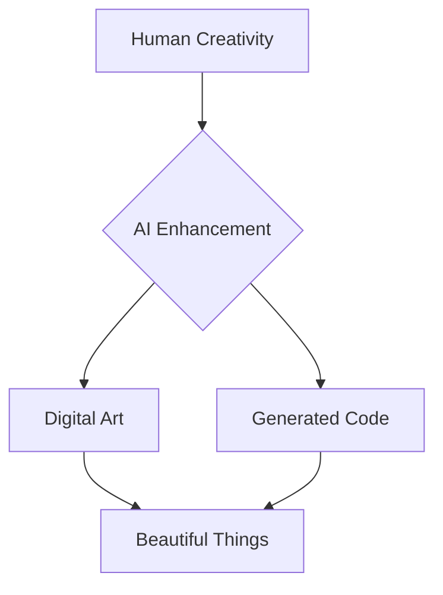

Welcome to my digital laboratory! This is where I'll be sharing my experiments at the intersection of art, code, and artificial intelligence.

## What to Expect

Here you'll find:
- AI-generated art explorations
- Code snippets and tutorials
- Thoughts on the future of creativity
- Gallery showcases of my work

## A Quick Code Example

Here's a simple Python snippet to get us started:

```python
def create_art():
    """Where code becomes canvas"""
    imagination = float('inf')
    creativity = lambda x: x ** imagination
    return creativity(inspiration)

print("Let's make something beautiful!")
```

## Mermaid Diagram Test



Stay tuned for more experiments from the lab!